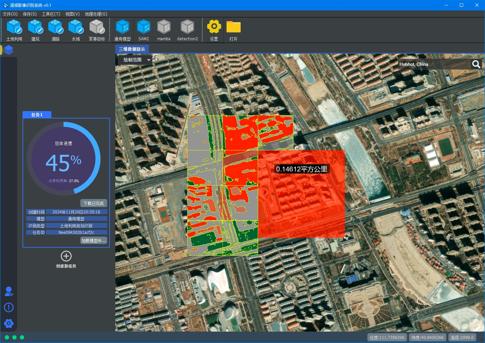

# SeggisV1.0
声明：个人开发，开源软件，禁止商用。
### 0. 源码下载地址

### 1. 简介
Seggis是一个基于Qt的GIS开发平台，提供影像下载服务，影像识别服务，数据保存与集成服务。开源免费，使用简单，性能高效，支持全球影像下载，支持在线批量识别，支持数据保存与集成。

### 2.开始UI

### 3.进入软件

- 工具栏
- 主界面
- 状态栏
- 侧边栏
- 可移动吸附的工具栏

### 4.新建任务

#### 创建任务
- 包含任务ID
- 创建任务时间
- 当前任务使用的AI模型

### 5.绘制选取
###### 绘制您关心的区域，后端服务会为您计算该区域在球面的面积大小，并评估区域的地图大小，点击开始下载，即可下载该区域的遥感影像，当进度为100%，表示下载完成，下载的遥感影像为WGS84坐标，可以在任何地理信息软件中加载
###### 您也可以点击右上角搜索按钮，直接调整您关心的地点
---------------------------------

### 6.影像识别
###### 点击开始识别按钮，即可识别您所选区域的影像，当进度为100%时，表示区域内的影像已识别完毕
---------------------------------

### 7.设置侧边栏
###### 您可以设置是否以动画形式识别区域，默认开启识别动画模式，在设置侧边栏还可以动态调整识别所需的线程数与要识别的遥感影像瓦片等级，根据您个人电脑配置加快识别过程，根据您个人喜好下载所需分辨率的遥感影像
---------------------------------

### 8.导出识别结果
###### 识别完成后，可以导出识别结果，点击菜单栏，文件-》导出识别，识别结果为WGS84坐标的geojson文件，可以在任何地理信息软件中加载
---------------------------------

### 9.导出识别结果
###### 识别完成后，可以导出识别结果，点击菜单栏，文件-》导出识别，识别结果为WGS84坐标的geojson文件，可以在任何地理信息软件中加载
---------------------------------

### 10.个人侧边栏
###### 提供技术支持与在线更新功能，在使用中有任何使用问题，均可在线咨询
---------------------------------

### 11.退出
###### 退出时会询问您是否退出，防止因错误点击导致中途退出
---------------------------------
